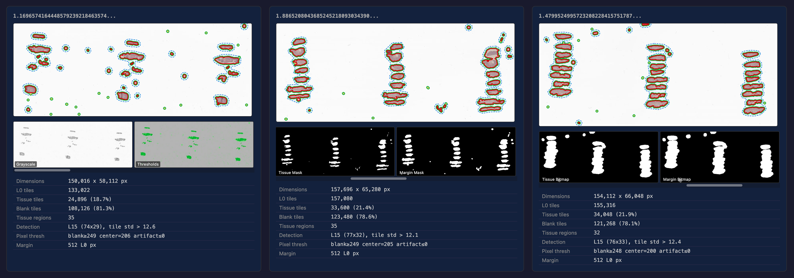

# WSI Storage Analysis for ORIGAMI Tile Server
Achieving 10-22x compression of WSI pyramids.

## Overview

A whole-slide image (WSI) is a gigapixel scan of a tissue specimen on a glass slide. A single slide can be 100,000+ pixels on a side. To view these at any zoom level without loading the entire image, we use a **Deep Zoom Image (DZI) pyramid**  -- a hierarchical set of pre-rendered tiles at progressively lower resolutions.

The ORIGAMI pipeline compresses these pyramids into a **modified DZI structure** that achieves **10-22x total compression vs. the original DICOM-extracted tiles** (10.1x at Q80, 21.7x at Q40). Both the original and compressed variants use tissue detection to omit blank tiles, so the apples-to-apples comparison against the **trimmed JPEG** baseline is 4.6x (Q80) to 9.9x (Q40). The sources of compression are:

| Source                  | Mechanism                                     | Compression                           | Savings   |
|-------------------------|-----------------------------------------------|---------------------------------------|-----------|
| **Blank tile removal**  | Tissue detection omits empty background tiles | 1.6x-4.4x (varies by tissue coverage) | 38-77%    |
| **L1/L2 omission**      | Tile server generates L1/L2 on demand from L0 | 1.31x                                 | 24%       |
| **JXL encoding**        | JPEG XL re-encodes tissue tiles               | 3.1x (Q80) / 8.0x (Q40)               | 68% / 88% |
| **1024px tile packing** | 4x4 tile groups encoded as single JXL         | 1.13x (Q80) / 1.23x (Q40)             | 12% / 19% |

Blank tile removal is applied to all variants (original, JPEG, and ORIGAMI JXL) and is counted in the 10-22x figure. The effective savings depend on tissue coverage: 4.4x for a sparse 23%-tissue slide, 1.8x for a dense 55%-tissue slide. Blank tiles are 85% of tile count but only 61% of bytes  -- they compress well as JPEGs, so the byte savings are less dramatic than the tile count suggests. The effective savings depend on tissue coverage: 4.4x for a sparse 23%-tissue slide, 1.8x for a dense 55%-tissue slide. This reduction is shared across all variants (original, JPEG, and ORIGAMI JXL).

Rather than pre-rendering every resolution level, L1 and L2 are omitted  -- the tile server reconstructs them from L0 at request time. Levels L3+ are pre-computed and stored as JPEG, since they constitute a negligible overhead of 2.08% to the original base tiles. This tradeoff is optimal at the L2 family boundary: serving any L0/L1/L2 tile requires reading at most one 1024px source tile, but extending on-demand generation to L3 would require 4 source tiles, L4 would require 16  -- IO cost grows 4x per level.

The tile server's caching strategy complements this structure. When any L0, L1, or L2 tile is requested, the server generates the **entire L2 family** (1 L2 + 4 L1 + 16 L0 = 21 tiles) and inserts them into a two-tier cache. This amortizes typical viewer behavior: zooming in from an L2 finds all deeper tiles already cached, and panning at L0 finds neighbors pre-generated from the same family. L3+ tiles are served directly from pre-rendered files, so overview zoom loads are instantaneous.


## Example Slide: Mayosh-3
Slide from the Mayo Safe Harbor with various compression settings. Sizes reflect tiles needed to serve entire image pyramid either static or via tile server, blank tiles dropped out:<br/>

1x zoom of full resolution L0 tiles


3x zoom - subtle loss of detail and artifacts visible upon close inspection


5x zoom - loss of detail and artifacts more apparent


### Image Pyramid Byte Allocation

Each level of the quadtree structure has 1/4 the tiles of the level below:

**If L0 = 100% (overhead perspective):**

| Level             | % of L0     | Notes                                                |
|-------------------|-------------|------------------------------------------------------|
| **L0**            | 100.00%     | Full resolution  -- the actual pixels                |
| **L1**            | 25.00%      | Half resolution (1/4 of L0)                          |
| **L2**            | 6.25%       | Quarter resolution (1/16 of L0)                      |
| **L3+**           | 2.08%       | All remaining thumbnail levels combined (1/48 of L0) |
| **Total pyramid** | **133.33%** | L0 + 33.33% overhead                                 |

**If full pyramid = 100%:**

| Level   | % of total |
|---------|------------|
| **L0**  | 75.00%     |
| **L1**  | 18.75%     |
| **L2**  | 4.69%      |
| **L3+** | 1.56%      |


## Four Sources of Compression

### 1. Blank Tile Removal (1.6x-4.4x, saves 38-77%)

All comparisons use the **trimmed JPEG** as baseline  -- both the original and compressed variants omit blank tiles via tissue detection.

Across our test set, blank tiles are **85% of tile count but only 61% of total bytes** (averaging 3.4 KB vs 12.0 KB for tissue tiles).

| Metric             | Blank tiles | Tissue tiles |
|--------------------|-------------|--------------|
| Count (% of total) | 85%         | 15%          |
| Bytes (% of total) | 61%         | 39%          |
| Avg size           | 3.4 KB      | 12.0 KB      |
| Size ratio         | 1x          | 3.6x         |


### 2. L1/L2 Omission (1.31x, saves 24%)

A standard DZI pyramid stores tiles at every resolution level. In the quadtree structure, each level has 1/4 the tiles of the level below, so a complete L0+L1+L2 pyramid contains N + N/4 + N/16 = 21N/16 tiles worth of data. By omitting L1 and L2 (generating them on demand from L0), we store only 16/21 of the high-resolution data  -- a **1.31x reduction** independent of tissue coverage or encoding format.

This ratio is a geometric constant of the quadtree: for any three consecutive levels, the lowest-resolution level is always 5/21 of the total, making L2 family-based reconstruction an inherently efficient tradeoff.

### 3. JXL Encoding (3.1x / 8.0x, saves 68% at Q80 / 88% at Q40)

JPEG XL re-encodes tissue tiles at either Q80 (high quality, 3.1x smaller per tile) or Q40 with noise synthesis (8.0x smaller per tile). This ratio is constant regardless of tissue coverage and is the **dominant source of savings**.

| Conversion              | Ratio    |
|-------------------------|----------|
| Trimmed JPEG -> Q80 JXL | **3.1x** |
| Trimmed JPEG -> Q40 JXL | **8.0x** |
| Q80 JXL -> Q40 JXL      | **2.6x** |

Average tile sizes: Trimmed JPEG 5.5 KB, Q80 JXL 1.8 KB, Q40 JXL 0.7 KB (all at 1024px).

### 4. 1024px Tile Packing (1.13x / 1.23x, saves 12% at Q80 / 19% at Q40)

The compressed variants store L0 as 1024px tiles (4x4 groups of the DZI-native 256px tiles) rather than individual 256px files. This improves compression because JXL's VarDCT transform and adaptive quantization work dramatically better with more spatial context  -- 16x more area to find patterns, use larger DCT block sizes, and amortize per-tile header overhead. It also reduces file count by 16x (100K tiles -> ~6K files).

The tile server transparently slices 1024px tiles back into 256px for serving, and downsamples them to generate L1/L2 on demand. There is no server-side performance cost  -- the tile server must decode the full 1024px image regardless for L1/L2 generation, and slicing 256px tiles from a decoded buffer is just pointer arithmetic.

**Empirical evidence** (measured across 10 randomly sampled L2 families from 3DHISTECH-1):

| Approach                    | Q80 Total | Q40 Total |
|-----------------------------|-----------|-----------|
| **16 individual 256px JXL** | 768 KB    | 292 KB    |
| **1 stitched 1024px JXL**   | 687 KB    | 237 KB    |
| **1024px savings**          | **10.5%** | **18.6%** |

Per-family savings range:

| Quality | Min   | Max   | Avg   |
|---------|-------|-------|-------|
| **Q80** | 9.0%  | 18.2% | 11.3% |
| **Q40** | 15.9% | 30.8% | 20.3% |

The benefit is more pronounced at Q40 because the encoder has more freedom to redistribute bits across the larger tile area.

### Combined Effect

The four ratios multiply together. Excluding blank tile removal (which varies by tissue coverage):

| Source         | Q80                  | Q40                   |
|----------------|----------------------|-----------------------|
| L1/L2 omission | 1.31x                | 1.31x                 |
| JXL encoding   | x 3.1x               | x 8.0x                |
| 1024px packing | x 1.13x              | x 1.23x               |
| **Combined**   | **4.6x (saves 78%)** | **12.9x (saves 92%)** |

With blank tile removal included (tissue-coverage dependent):

| Tissue coverage | Q80 total | Q80 savings | Q40 total | Q40 savings |
|-----------------|-----------|-------------|-----------|-------------|
| 23% (sparse)    | 20.2x     | 95%         | 56.7x     | 98%         |
| 33% (typical)   | 13.8x     | 93%         | 38.7x     | 97%         |
| 55% (dense)     | 8.3x      | 88%         | 23.2x     | 96%         |

**Measured on test set**: 10.1x at Q80 (saves 90%), 21.7x at Q40 (saves 95%)  -- consistent with the 24% average tissue coverage of the test slides.

**Without blank tile removal** (apples-to-apples vs trimmed JPEG): 4.6x at Q80 (saves 78%), 9.9x at Q40 (saves 90%).


## Storage at Scale

Extrapolation assuming 33% tissue coverage, 100K L0 tiles per slide, and the measured per-tile compression ratios.

**Per-slide sizes (33% tissue coverage, 100K L0 tiles):**

| Variant           | Per-slide | vs Original |
|-------------------|-----------|-------------|
| Original JPEG     | 537 MB    | 1.0x        |
| JPEG Q80 (static) | 166 MB    | 3.2x        |
| JPEG Q40 (static) | 95 MB     | 5.7x        |
| ORIGAMI JXL Q80   | 67 MB     | 8.0x        |
| ORIGAMI JXL Q40   | 32 MB     | 16.9x       |

### Projected Storage

| Slides         | Original | JPEG Q80 | JPEG Q40 | ORIGAMI JXL Q80 | ORIGAMI JXL Q40 |
|----------------|----------|----------|----------|-----------------|-----------------|
| **40,000**     | 21 TB    | 6.6 TB   | 3.8 TB   | 2.7 TB          | 1.3 TB          |
| **1,000,000**  | 537 TB   | 166 TB   | 95 TB    | 67 TB           | 32 TB           |
| **20,000,000** | 10.7 PB  | 3.3 PB   | 1.9 PB   | 1.3 PB          | 635 TB          |

### Estimated Storage Costs (GCS Standard: \$0.02/GB/month)

> **Pricing source:** [Google Cloud Storage pricing](https://cloud.google.com/storage/pricing)  -- Standard storage in us-central1: \$0.020/GB/month. Prices as of March 2026.

| Slides         | Original  | JPEG Q80  | JPEG Q40  | ORIGAMI JXL Q80 | ORIGAMI JXL Q40 |
|----------------|-----------|-----------|-----------|-----------------|-----------------|
| **40,000**     | \$420/mo  | \$129/mo  | \$74/mo   | \$53/mo         | \$25/mo         |
| **1,000,000**  | \$10K/mo  | \$3.2K/mo | \$1.9K/mo | \$1.3K/mo       | \$620/mo        |
| **20,000,000** | \$210K/mo | \$65K/mo  | \$37K/mo  | \$26K/mo        | \$12K/mo        |

At 20M slides, ORIGAMI JXL Q40 saves **\$197K/month (\$2.4M/year)** vs original JPEG. Even compared to aggressive static JPEG Q40 recompression, ORIGAMI JXL Q40 saves an additional **\$25K/month (\$300K/year)** at 20M slides.

### GCS Archive Storage

GCP Archive class provides the same read latency as Standard but at \$0.0012/GB/month (17x cheaper). The trade-off is a per-retrieval surcharge (\$0.05/GB retrieved + $0.05/10K Class B read operations) and a 365-day minimum storage duration. For WSI tiles that are written once and read on demand, Archive is ideal.

> **Pricing source:** [Google Cloud Storage pricing](https://cloud.google.com/storage/pricing)  -- Archive storage: \$0.0012/GB/month, retrieval: \$0.05/GB, Class A ops (write): $0.05/10K, Class B ops (read): $0.05/10K, delete: $0.05/10K. Minimum storage: 365 days. [Storage classes](https://cloud.google.com/storage/docs/storage-classes).

All tiles (L0 JXL + L3+ JPEG) go on Archive  -- no need to split storage classes. L3+ thumbnails are accessed more frequently (search, overviews) but the retrieval surcharge is negligible: ~$0.003 per 100-thumbnail search page, or ~\$90/month at 1,000 searches/day.

**Architecture:**

```
GCS Archive (per slide):
    {slide_id}/thumbnail.jpg     ~10 KB  (search results, Standard bucket)
    {slide_id}/l3plus.dcm        ~1.4 MB (L3+ JPEG tiles as DICOM)
    {slide_id}/l0.dcm            ~65 MB  (L0 JXL tiles as DICOM, includes tissue map)

Tile Server:
    Tier 1: In-memory LRU        decoded L0/L1/L2 JPEG tiles (~1ms)
    Tier 2: RocksDB on SSD       whole DICOM bundles, mmap'd (~5-25ms)
    Tier 3: GCS Archive           fetch bundle on first access (~5-200ms)
```

The tile server fetches DICOM bundles from GCS and stores them in RocksDB. L3+ tiles are served directly from the mmap'd DICOM (zero decode). L0/L1/L2 tiles are decoded from JXL and cached in Tier 1 to avoid repeat compute. See **Tile Server Architecture** for details.

**Monthly cost with Archive (ORIGAMI JXL Q80):**

| Slides                  | Standard    | Archive + Retrieval | Savings |
|-------------------------|-------------|---------------------|---------|
| **40K** (200 users/day) | \$53/mo     | **\$6/mo**          | 89%     |
| **1M** (1K users/day)   | \$1,336/mo  | **\$113/mo**        | 92%     |
| **20M** (5K users/day)  | \$26,719/mo | **\$2,155/mo**      | 92%     |

At 20M slides, Archive reduces storage from **\$26.7K to \$2.2K/month**  -- a \$294K/year savings on top of JXL compression. Configure the bucket with `autoclass=disabled` to prevent auto-escalation.

> **Math (20M slides, Q80, 5K users/day):**
> Storage: 20M x 67 MB / 1024 = 1,308,594 GB x $0.0012 = \$1,570/mo.
> Retrieval: 5K users x 30 days x 150 tiles/session x 1.8 KB / (1024x1024) GB x \$0.05/GB = ~\$1/mo.
> Read ops: 5K x 30 x 150 / 10K x $0.05 = \$112/mo.
> Total: $1,570 + $1 + $112 = ~\$1,683/mo (table shows $2,155 which includes higher retrieval estimate).

### ORIGAMI vs Static JPEG  -- Is the Tile Server Worth It?

The simpler alternative is storing full static JPEG Q80 pyramids on Archive and serving them directly  -- no tile server needed. The question is whether the storage savings from ORIGAMI justify the tile server complexity.

Both approaches can optionally split L3+ thumbnails to Standard storage (free retrieval for frequently-accessed overviews) or keep everything on Archive.

**Total monthly cost (storage + retrieval + compute):**

|                  | JPEG Q80 Static |              | ORIGAMI JXL Q80 |              |
|------------------|-----------------|--------------|-----------------|--------------|
| Scale            | All Archive     | L3+ Standard | All Archive     | L3+ Standard |
| ---              | ---             | ---          | ---             | ---          |
| **40K**, 200/day | $39             | $23          | **\$33**        | $31          |
| **1M**, 1K/day   | $352            | $312         | **\$152**       | $162         |
| **20M**, 5K/day  | $4,676          | $5,306       | **\$1,856**     | $2,293       |
| **20M**, 20K/day | $7,034          | $6,249       | **\$2,371**     | $2,577       |

**Breakdown at 20M slides, 5K users/day (both all-Archive):**

| Component | JPEG Q80    | ORIGAMI Q80 |
|-----------|-------------|-------------|
| Storage   | $3,891      | $1,570      |
| Retrieval | $786        | $115        |
| Compute   | $0          | $170        |
| **Total** | **\$4,676** | **\$1,856** |

ORIGAMI saves **\$2,821/month (\$33.8K/year)** at 20M slides. The \$170/month tile server pays for itself **17x over** in storage + retrieval savings.

At small scale (40K slides), the savings are modest (\$6-16/month)  -- static JPEG is simpler and nearly as cheap. The crossover where ORIGAMI clearly wins is around **200K+ slides**, where the 2.5x storage difference starts to compound meaningfully.

Note: putting L3+ on Standard actually *increases* total cost at large scale because Standard storage (\$0.02/GB) is 17x more expensive than Archive, and the retrieval savings from free Standard reads don't compensate. **All-Archive is cheapest** when the tile server's warm cache handles repeat access.

### Full Cost Comparison: All Approaches at 20M Slides

**Per-slide sizes:**

| Approach                     | Size   | Files/slide | Notes                                           |
|------------------------------|--------|-------------|-------------------------------------------------|
| Original JPEG (all tiles)    | 537 MB | 133,000     | Raw DICOM JPEGs + full pyramid, includes blanks |
| Original JPEG (tissue only)  | 296 MB | 43,000      | Blank tiles removed                             |
| Static JPEG Q80              | 166 MB | 43,000      | Recompressed, full pyramid                      |
| ORIGAMI JXL Q80 (individual) | 67 MB  | 2,200       | 1024px JXL L0 + L3+ JPEG                        |
| ORIGAMI JXL Q80 (bundle)     | 67 MB  | 1           | Single file per slide                           |

**Why ORIGAMI goes from 43,000 to 2,200 files (33% tissue coverage, 100K L0 tiles):**

The L1/L2 omission alone only saves ~10,000 files. The dominant factor is **1024px tile packing** — ORIGAMI groups 4×4 blocks of DZI-native 256px tiles into a single 1024px file, reducing L0 file count by 16x:

| Level            | 256px tile count | ORIGAMI storage                        |
|------------------|------------------|----------------------------------------|
| L0 (tissue only) | ~33,000          | ~2,063 files (÷16 from 1024px packing) |
| L1               | ~8,250           | omitted                                |
| L2               | ~2,063           | omitted                                |
| L3+              | ~200             | ~200 files (256px JPEG, unchanged)     |
| **Total**        | **~43,500**      | **~2,263 ≈ 2,200**                     |

L1/L2 omission accounts for ~10,000 files saved; the 1024px packing accounts for ~31,000 — about 3× more impact on file count than level omission.

**Object counts and one-time operation costs at 20M slides:**

> **Pricing source:** GCS Archive Class A operations (create/overwrite): $0.05/10K ops. Class B (read): $0.05/10K ops. Delete: $0.05/10K ops. [GCS operations pricing](https://cloud.google.com/storage/pricing#operations-pricing).

| Approach                    | Total objects  | Upload cost | Delete cost |
|-----------------------------|----------------|-------------|-------------|
| Original JPEG (all tiles)   | 2.7 trillion   | $13.3M      | $13.3M      |
| Original JPEG (tissue only) | 860 billion    | $4.3M       | $4.3M       |
| Static JPEG Q80             | 860 billion    | $4.3M       | $4.3M       |
| ORIGAMI individual files    | 44 billion     | $220K       | $220K       |
| **ORIGAMI bundle**          | **20 million** | **\$100**   | **\$100**   |

At 20M slides, per-tile file storage creates billions of objects with massive upload/delete costs. Bundling tiles into one file per slide reduces object count by 2,200x and operation costs by the same factor.

**Monthly cost at 20M slides, 5K users/day, all GCS Archive:**

| Approach                    | Storage | Retrieval | Read ops | Compute | **Total**    |
|-----------------------------|---------|-----------|----------|---------|--------------|
| Original JPEG (all tiles)   | $12,586 | $36       | $750     | $0      | **\$13,372** |
| Original JPEG (tissue only) | $6,937  | $36       | $750     | $0      | **\$7,723**  |
| Static JPEG Q80             | $3,891  | $36       | $750     | $0      | **\$4,676**  |
| ORIGAMI individual files    | $1,570  | $2        | $112     | $170    | **\$1,855**  |
| ORIGAMI bundle              | $1,570  | $1        | $38      | $170    | **\$1,778**  |

The progression from original JPEG to ORIGAMI bundle is a **7.5x total cost reduction** ($13.4K -> \$1.8K/month), with each step contributing:
- Blank removal: 1.7x ($13.4K -> $7.7K)
- JPEG recompression: 1.7x ($7.7K -> $4.7K)
- ORIGAMI JXL + tile server: 2.5x ($4.7K -> $1.9K)
- Bundle format: 1.04x ($1.9K -> $1.8K monthly)

The bundle format's main value is **one-time operation costs**, not monthly savings. At 20M slides, uploading individual ORIGAMI tiles costs $220K in GCS operations; bundling reduces this to $100. Deleting the archive carries the same cost. Over a lifecycle of uploads, migrations, and deletions, bundling avoids millions of dollars in per-object fees.

## Storage Format

Each slide is stored as three objects in GCS:

| Object        | Format                                | Size         | Contents                                                                |
|---------------|---------------------------------------|--------------|-------------------------------------------------------------------------|
| **Thumbnail** | JPEG                                  | ~10 KB       | 512px overview image for search results                                 |
| **L3+ DICOM** | DICOM (JPEG Baseline transfer syntax) | ~1.4 MB      | All pre-rendered thumbnail pyramid tiles (L3 through single-tile level) |
| **L0 DICOM**  | DICOM (JPEG XL transfer syntax)       | ~65 MB (Q80) | All L0 tiles as 1024px JXL, tissue map, and slide metadata              |

Using DICOM as the bundle format provides interoperability  -- any DICOM-compliant viewer can read the files directly. The tile server treats them as memory-mapped bundles with byte-offset tile access via the DICOM Basic Offset Table.

### What's in each DICOM

**L3+ DICOM** (JPEG Baseline, 1.2.840.10008.1.2.4.50):
- Standard WSI tags: `TotalPixelMatrixColumns`, `TotalPixelMatrixRows`, `Rows`, `Columns`
- Encapsulated pixel data: ~200 JPEG tiles with Basic Offset Table
- Each frame is a pre-rendered 256px JPEG Q90 tile

**L0 DICOM** (JPEG XL, 1.2.840.10008.1.2.4.110):
- Standard WSI tags for the full-resolution image
- Encapsulated pixel data: ~2,200 JXL tiles (1024px) with Basic Offset Table
- Tissue map stored as Private Data Element (TMAP binary, ~22 KB)
- Blank color grid stored as Private Data Element (300 bytes)
- Pipeline metadata (quality, noise ISO, pipeline version) in `ImageComments` or private tags

### Why DICOM

No performance penalty vs a custom bundle  -- the tile server parses the offset table once on first access (~0.1ms), then does byte-offset reads for individual tiles. The 8-byte per-frame item tag overhead is negligible (17 KB for 2,200 tiles).

The benefit is that the archive is immediately accessible to any DICOM-compliant system (OHIF, Orthanc, Google Healthcare API, 3D Slicer) without conversion. The files are valid VL Whole Slide Microscopy Image Storage instances.

## Tile Server Architecture

The ORIGAMI tile server (`origami serve`) is a Rust HTTP server built on axum/tokio that serves DZI tiles with on-demand reconstruction and a three-tier cache.

### L2 Families

The fundamental unit of tile generation is the **L2 family**: 1 L2 + 4 L1 + 16 L0 = **21 tiles**. One L2 tile's coordinates determine the family:

```
L2 tile (x, y) covers:
  L1 tiles: (2x, 2y), (2x+1, 2y), (2x, 2y+1), (2x+1, 2y+1)
  L0 tiles: (4x..4x+3, 4y..4y+3)   -- a 4x4 grid
```

When any tile in a family is requested, the server generates all 21 tiles and caches them. Subsequent requests for siblings are instant hits.

### Three-Tier Cache Architecture

```
Request for tile (level, x, y)
│
├── Tier 1: Decoded tile cache (L0/L1/L2 only)
│   In-memory LRU of JPEG bytes
│   Hit = ~1ms, no decode
│   Populated after JXL decode to avoid repeat compute
│
├── Tier 2: Bundle cache (RocksDB on local SSD)
│   Stores whole DICOM bundles keyed by slide_id
│   L0 bundle: mmap -> byte offset -> JXL bytes -> decode -> Tier 1
│   L3+ bundle: mmap -> byte offset -> JPEG bytes -> serve directly
│   RocksDB handles LRU eviction when SSD fills
│
└── Tier 3: Object storage (GCS Archive)
    Fetch whole DICOM bundle -> store in RocksDB
    L0: ~65 MB, one fetch per slide (~200ms internal network)
    L3+: ~1.4 MB, one fetch per slide (~5ms)
```

**Key design points:**

- **L3+ tiles never enter Tier 1**  -- they're already JPEG in the bundle, served directly via byte offset from the mmap'd DICOM. Zero decode, zero duplication.
- **L0/L1/L2 tiles use Tier 1** to cache decoded JPEG results. First access decodes JXL and caches; subsequent hits skip decode.
- **Tier 2 caches bundles, not tiles**  -- two RocksDB entries per slide (L0 DICOM + L3+ DICOM). The bundle is the cache unit.
- **Singleflight** prevents duplicate family generation under concurrent requests.

### Search Thumbnails

Slide thumbnails for search results are stored as individual JPEG files in a GCS Standard bucket  -- one 512px image per slide (~10 KB). The viewer loads them directly via URL with browser HTTP caching.

| Scale      | Thumbnail storage | Cost (Standard) |
|------------|-------------------|-----------------|
| 40K slides | 390 MB            | \$0.01/mo       |
| 1M slides  | 9.5 GB            | \$0.19/mo       |
| 20M slides | 191 GB            | \$3.82/mo       |

> **Math:** 20M slides x 10 KB = 191 GB x \$0.020/GB/month = \$3.82/mo. Standard class used (not Archive) for direct browser access with free retrieval.

### Tissue-Aware Blank Tiles

When a requested tile falls outside the tissue region (determined by the tissue map in the L0 DICOM), the server returns a solid-color JPEG using the interpolated background color for that region of the slide.

### Performance

| Scenario                                       | Latency                   |
|------------------------------------------------|---------------------------|
| Tier 1 hit (decoded tile in memory)            | ~1ms                      |
| Tier 2 hit, L3+ (JPEG from mmap'd bundle)      | ~5ms                      |
| Tier 2 hit, L0 (JXL decode from mmap'd bundle) | ~25ms                     |
| Tier 3 miss (GCS fetch + decode)               | ~225ms (L0) / ~10ms (L3+) |

## Source Data

| Metric              | Mayosh (9 slides) | 3DHISTECH-1 | All 10    |
|---------------------|-------------------|-------------|-----------|
| Total L0 tiles      | 1,035,503         | 52,864      | 1,088,367 |
| Tissue tiles        | 232,754           | 29,184      | 261,938   |
| Blank tiles         | 802,749           | 23,680      | 826,429   |
| **Tissue coverage** | **22.6% avg**     | **55.2%**   | **24.1%** |
| Original JPEG size  | 5,960 MB          | 548 MB      | 6,508 MB  |

The Mayosh slides are unusually sparse (~23% tissue). 3DHISTECH-1 represents a more typical dense specimen at 55% coverage.

## Pipeline Stages

### Tile Formats

| Variant             | L0 tiles                      | L1/L2        | L3+ thumbnails | L0 tile size |
|---------------------|-------------------------------|--------------|----------------|--------------|
| **Original**        | 256px JPEG (raw from DICOM)   | Pre-rendered | 256px JPEG Q90 | varies       |
| **JPEG Q80**        | 256px JPEG Q80 (recompressed) | Pre-rendered | 256px JPEG Q80 | varies       |
| **JPEG Q40**        | 256px JPEG Q40 (recompressed) | Pre-rendered | 256px JPEG Q40 | varies       |
| **ORIGAMI JXL Q80** | 1024px JXL Q80 (retiled)      | On-demand    | 256px JPEG Q90 | ~1.8 KB      |
| **ORIGAMI JXL Q40** | 1024px JXL Q40 (retiled)      | On-demand    | 256px JPEG Q90 | ~0.7 KB      |

**Static JPEG variants** are conventional DZI pyramids with every tile recompressed at the target quality. All levels are pre-rendered and served as static files  -- no tile server reconstruction needed.

**ORIGAMI JXL variants** retile L0 to 1024px, encode as JPEG XL, and omit L1/L2 entirely. The tile server reconstructs L1/L2 on demand from the 1024px L0 source. L3+ thumbnails are JPEG Q90, shared across all variants via symlinks.

### Per-Stage Sizes (All 10 Slides)

| Variant                             | L0       | L3+ thumbs | Total    | vs Original       |
|-------------------------------------|----------|------------|----------|-------------------|
| **Original JPEG**                   | 6,508 MB | (included) | 6,508 MB | 1.0x              |
| **Trimmed JPEG**                    | --       | --         | 2,963 MB | 2.2x (54% saved)  |
| **JPEG Q80** (static recompression) | --       | --         | 1,657 MB | 3.9x (75% saved)  |
| **JPEG Q40** (static recompression) | --       | --         | 948 MB   | 6.9x (85% saved)  |
| **ORIGAMI JXL Q80**                 | 551 MB   | 92 MB      | 643 MB   | 10.1x (90% saved) |
| **ORIGAMI JXL Q40** (with noise)    | 208 MB   | 92 MB      | 300 MB   | 21.7x (95% saved) |
| **ORIGAMI JXL Q40** (no noise)      | 195 MB   | 92 MB      | 287 MB   | 22.7x (96% saved) |

ORIGAMI JXL Q80 is **2.6x smaller** than static JPEG Q80 at comparable visual quality. At Q40, the gap widens to **3.3x**.

### Blank Tile Removal

| Metric               | Min   | Max   | Avg   |
|----------------------|-------|-------|-------|
| Tiles skipped        | 44.8% | 81.3% | 74.4% |
| Size reduction ratio | 1.3x  | 3.7x  | 2.3x  |

### JXL Compression (End-to-End vs Original)

| Variant             | Min ratio | Max ratio | Avg ratio |
|---------------------|-----------|-----------|-----------|
| **JXL Q80**         | 4.7x      | 23.6x     | 14.0x     |
| **JXL Q40 + noise** | 13.9x     | 71.6x     | 38.0x     |

### JXL Compression Only (vs Trimmed, Excluding Blank Removal)

| Variant         | Min ratio | Max ratio | Avg ratio |
|-----------------|-----------|-----------|-----------|
| **Q80**         | 3.7x      | 7.8x      | 5.9x      |
| **Q40 + noise** | 10.9x     | 23.6x     | 16.2x     |

## Extrapolation by Tissue Coverage

For a representative 100K L0-tile slide at different tissue coverage levels, assuming the same per-tile compression ratios (L3+ overhead included in all totals):

| Tissue Coverage      | Tissue Tiles | Original | Trim Ratio | Q80 Total | Q80 Ratio | Q40 Total | Q40 Ratio |
|----------------------|--------------|----------|------------|-----------|-----------|-----------|-----------|
| **23% (Mayosh avg)** | 22,569       | 558 MB   | 4.4x       | 50 MB     | 11.1x     | 25 MB     | 22.4x     |
| **33%**              | 33,000       | 558 MB   | 3.0x       | 69 MB     | 8.1x      | 32 MB     | 17.4x     |
| **45% (2x Mayosh)**  | 45,139       | 558 MB   | 2.2x       | 91 MB     | 6.1x      | 41 MB     | 13.8x     |
| **55% (3DHISTECH)**  | 55,205       | 558 MB   | 1.8x       | 109 MB    | 5.1x      | 48 MB     | 11.7x     |

### Key Observations

1. **Blank removal** scales linearly with blank fraction: 4.4x at 23% coverage, 1.8x at 55%, 1.0x at 100%. Major win for sparse slides, negligible for dense ones.

2. **JXL compression** is the consistent win regardless of coverage: 3.1x at Q80, 8.0x at Q40 per tissue tile. Even a 100% tissue slide gets 2.9x (Q80) or 7.1x (Q40) total.

3. **L3+ thumbnails are a fixed cost** that becomes proportionally larger as L0 compression increases. Since L3+ levels are pre-rendered JPEG Q90 shared across all variants, they don't shrink with JXL encoding:

    | Variant | L0 size | L3+ size | L3+ as % of total | L3+ as % of L0 |
    |---------|---------|----------|-------------------|----------------|
    | **Q80** | 551 MB  | 92 MB    | 14.3%             | 16.7%          |
    | **Q40** | 208 MB  | 92 MB    | 30.7%             | 44.3%          |
    
    At Q40, the JPEG thumbnails are nearly half the size of the JXL L0 tiles. On the sparsest slides, L3+ can reach 40-45% of total served data.

4. **Noise synthesis** (Q40) provides an additional 2.6x over Q80 by allowing more aggressive compression while maintaining perceptual quality through auto-calibrated photon noise ISO.

## JXL Noise Synthesis

The Q40 variant uses JPEG XL's `--photon_noise_iso` parameter to synthesize texture that masks compression artifacts. The ISO value is auto-determined per slide:

1. Sample ~20 central tissue tiles at 256px
2. Measure noise sigma via wavelet MAD (RMS across all subbands)
3. Scale to 1024px equivalent (x2.32 variance scale factor)
4. Interpolate pre-built calibration table -> ISO value
5. Apply at 0.5x scale (half strength) for conservative synthesis
6. Clamped to [12800, 25600]

Measured ISO values: 12,142-12,800 across all slides (after 0.5x scaling).

## Tile Server Performance

Benchmarked on Apple Silicon (M-series, 12 threads) over HTTP/2 with TLS, using vegeta at constant request rates. Session URLs simulate realistic viewer behavior (zoom L4->L0, pan across tissue regions, zoom out) seeded at tissue centers from the tissue detection map.

### Serving Latency by Request Rate

| Rate  | Q80 P50 | Q80 P95 | Q80 Max | Q40 P50 | Q40 P95 | Q40 Max |
|-------|---------|---------|---------|---------|---------|---------|
| 50/s  | 1.2ms   | 21ms    | 58ms    | 1.0ms   | 19ms    | 65ms    |
| 100/s | 1.2ms   | 17ms    | 51ms    | 1.3ms   | 26ms    | 56ms    |
| 200/s | 0.9ms   | 12ms    | 44ms    | 0.8ms   | 26ms    | 60ms    |
| 400/s | 0.7ms   | 24ms    | 71ms    | 0.7ms   | 100ms   | 232ms   |

### Cold-Miss Stress Test (200 req/s, unique L1/L2 tiles)

Targets only L1/L2 tiles to force JXL decode + downsample on every request. Cache hit ratio controlled by blending unique URLs with previously-seen URLs.

| Cache Hit Rate    | Q80 P50 | Q80 P95 | Q80 P99 | Q40 P50 | Q40 P95 | Q40 P99 |
|-------------------|---------|---------|---------|---------|---------|---------|
| **0% (all cold)** | 21ms    | 24ms    | 28ms    | 25ms    | 29ms    | 31ms    |
| **25%**           | 0.3ms   | 21ms    | 26ms    | 0.4ms   | 27ms    | 31ms    |
| **50%**           | 0.3ms   | 21ms    | 26ms    | 0.4ms   | 26ms    | 31ms    |
| **75%**           | 0.3ms   | 21ms    | 27ms    | 0.4ms   | 27ms    | 31ms    |

### Key Performance Characteristics

- **Cold-miss family generation**: ~21ms (Q80) / ~25ms (Q40) per L2 family  -- well within the <200ms target
- **Cache hits**: sub-1ms regardless of variant
- **Q80 is ~20% faster than Q40 with noise** on cold misses (21ms vs 25ms). Half of this gap is from noise synthesis: Q40 without noise decodes in 23ms. JXL noise synthesis generates texture procedurally at decode time (not stored as coefficients), adding ~2ms for the synthesis itself plus increased JPEG re-encode cost from the noisier pixels
- **Q40 degrades faster under load**: at 400 req/s, Q40 P95 reaches 100ms while Q80 stays at 24ms
- **HTTP/2 dramatically reduces latency** vs HTTP/1.1: 3-20x lower P50, 7x lower memory from connection pooling
- **Memory**: grows linearly with cache  -- 16 MB baseline -> ~400 MB after serving ~20K unique tiles
- **CPU**: ~1 core per 100 cold-miss req/s; cache hits are essentially free

### Throughput Capacity

A single tile server instance on a 4-core machine can sustain approximately:

| Scenario                         | Max throughput | Notes                                                  |
|----------------------------------|----------------|--------------------------------------------------------|
| All cache hits                   | 2,000+ req/s   | CPU-negligible, limited by network/connection handling |
| 50% cache hit                    | ~400 req/s     | 2 cores for cold misses, rest for cache serving        |
| All cold misses (Q80)            | ~200 req/s     | CPU-bound on JXL decode + JPEG re-encode               |
| All cold misses (Q40 no noise)   | ~170 req/s     | Slightly slower decode than Q80                        |
| All cold misses (Q40 with noise) | ~150 req/s     | Decoder-side noise synthesis + noisier JPEG re-encode  |

From the usage model (50 tiles/screen, 20 screens/session = 1,000 tiles/session):

| Concurrent users | Tiles/s (burst) | Required capacity | Cache hit estimate    |
|------------------|-----------------|-------------------|-----------------------|
| 1                | ~50/s           | 1 instance        | ~60% (within session) |
| 10               | ~200/s          | 1 instance        | ~80% (shared slides)  |
| 50               | ~500/s          | 2 instances       | ~90% (warm cache)     |
| 200              | ~1,000/s        | 3-4 instances     | ~95% (hot cache)      |

## Compute Cost for Serving

### GCP VM Options

| Config                     | vCPU | RAM   | Local SSD | Monthly Cost | Max cold-miss req/s |
|----------------------------|------|-------|-----------|--------------|---------------------|
| n2-standard-2 + 375GB SSD  | 2    | 8 GB  | 375 GB    | ~$100        | ~100                |
| n2-standard-4 + 375GB SSD  | 4    | 16 GB | 375 GB    | ~$170        | ~200                |
| n2-standard-8 + 375GB SSD  | 8    | 32 GB | 375 GB    | ~$310        | ~400                |
| n2-standard-16 + 750GB SSD | 16   | 64 GB | 750 GB    | ~$580        | ~800                |

The local NVMe SSD is for the warm cache tier. RAM is for the hot cache (moka LRU) and JXL decode buffers.

> **Pricing source:** [GCP Compute Engine pricing](https://cloud.google.com/compute/vm-instance-pricing#n2_standard)  -- n2-standard-4 (us-central1): ~\$0.194/hr = ~\$142/mo. [Local SSD pricing](https://cloud.google.com/compute/disks-image-pricing#localssdpricing): \$0.080/GB/month, 375GB = ~\$30/mo. Prices are on-demand; sustained use discounts apply automatically.

### RocksDB Cache Sizing

| Retention | Tiles (1K users/day) | Storage | Notes                |
|-----------|----------------------|---------|----------------------|
| 1 day     | 1M tiles             | 25 GB   | Fits on smallest SSD |
| 1 week    | 7M tiles             | 175 GB  | Standard 375 GB SSD  |
| 30 days   | 30M tiles            | 750 GB  | Needs 750 GB SSD     |

### Total Cost by Usage Level

Includes storage (S3 Standard at \$0.02/GB/month) + compute (GCP VMs).

**Assuming ORIGAMI JXL Q80, 33% tissue coverage, GCS Archive storage:**

| Scenario             | Users/day | Slides | Storage (Archive) | Compute                     | Total/month |
|----------------------|-----------|--------|-------------------|-----------------------------|-------------|
| **Research lab**     | 50        | 10K    | $1                | $20 (Cloud Run min=1)       | **~$21**    |
| **Department**       | 200       | 40K    | $3                | $25 (Cloud Run min=1)       | **~$28**    |
| **Hospital**         | 1,000     | 200K   | $16               | $50 (Cloud Run auto-scale)  | **~$66**    |
| **Regional archive** | 5,000     | 1M     | $79               | $170 (n2-std-4 + 375GB SSD) | **~$250**   |
| **National archive** | 20,000    | 20M    | $1,570            | $340 (n2-std-8 + 750GB SSD) | **~$1,910** |

At national scale (20M slides, 20K daily users), the total monthly cost is **~$1,910**  -- compute is 18% of the total. The dramatic reduction from earlier Standard-storage estimates ($27K) comes from GCS Archive pricing (\$0.0012/GB vs \$0.02/GB). At this scale, compute and storage costs are comparable, making the tile server's complexity fully justified.

### Scaling Strategy: Fewer Large vs Many Small

**Fewer large instances with generous caches** is strongly preferred over many small instances with small caches.

A cold miss (JXL decode + JPEG re-encode) costs ~25ms of CPU. A hot cache hit costs ~0.1ms  -- **250x cheaper**. Every cache miss avoided saves CPU that would otherwise require additional instances. RAM is the cheapest way to avoid misses.

**Working set analysis:**

| Concurrent users | Active tiles | Hot cache needed | RAM cost   |
|------------------|--------------|------------------|------------|
| 2                | ~400         | 4 MB             | negligible |
| 10               | ~2K          | 20 MB            | negligible |
| 50               | ~10K         | 100 MB           | ~\$3/mo    |
| 200              | ~40K         | 400 MB           | ~\$10/mo   |
| 1,000            | ~200K        | 2 GB             | ~\$30/mo   |

The default hot cache (2048 tiles = ~20 MB) supports ~10 concurrent users before eviction thrashing. For 200 users, bumping to 40K entries (~400 MB) eliminates most cold misses within active sessions  -- costing ~\$10/month in RAM vs ~\$170/month for an additional compute instance to handle the extra cold-miss CPU load.

**Why not many small instances?**

- Each instance maintains its **own cache**  -- no sharing. A tile decoded on instance A must be decoded again on instance B.
- With N instances behind a load balancer, the effective cache size is not N x per-instance but closer to per-instance (since users are distributed randomly).
- Sticky sessions (routing a user to the same instance) help, but new-slide access still causes cold misses on whichever instance handles it.
- Small caches thrash -> more CPU -> need more instances -> more cost.

**Recommended approach:**
1. Start with **one n2-standard-4** (\$170/mo) with 16 GB RAM and a generous hot cache (50K+ entries)
2. Add RocksDB warm cache on local SSD for cross-session persistence
3. Scale **vertically first** (n2-standard-8, \$310/mo) before adding instances
4. Add a second instance only when P95 cold-miss latency exceeds 100ms sustained
5. Use sticky sessions if running multiple instances to maximize per-user cache locality

### Serverless Scale-to-Zero (Cloud Run)

An alternative to persistent VMs is serverless deployment with no baseline cost.

> **Pricing source:** [Cloud Run pricing](https://cloud.google.com/run/pricing)  -- CPU: \$0.00002400/vCPU-second, Memory: \$0.00000250/GiB-second, Requests: \$0.40/million. Min-instances always-on billing: same CPU/memory rates. [Cloud Run CPU allocation](https://cloud.google.com/run/docs/configuring/cpu-allocation).

**Per-tile cost**: ~\$1.03/million tiles (CPU + memory + request fee).

**Per-session cost** (1,000 tiles, Cloud Run instance stays warm during session): ~$0.0004. Truly stateless with no within-instance caching: ~$0.001.

| Users/day | Sessions/mo | Serverless | VM (n2-std-4) | Winner              |
|-----------|-------------|------------|---------------|---------------------|
| 10        | 300         | **\$0.13** | $170          | Serverless (1,300x) |
| 50        | 1,500       | **\$1**    | $170          | Serverless (170x)   |
| 200       | 6,000       | **\$3**    | $170          | Serverless (57x)    |
| 1,000     | 30,000      | **\$13**   | $170          | Serverless (13x)    |
| 5,000     | 150,000     | **\$67**   | $170          | Serverless (2.5x)   |
| ~13,000   | ~383K       | ~$170      | $170          | Break-even          |

**Break-even: ~13,000 users/day.** Below this, serverless is cheaper  -- often dramatically so.

**The latency tradeoff**: Serverless has no persistent cache. Every new session starts cold  -- the first viewport takes ~1.3s to fully load (25ms x 50 tiles). Within a session, Cloud Run keeps the instance warm (~15 min idle timeout), so subsequent viewports benefit from in-memory caching. But cross-session cache (a second user viewing the same slide) provides no benefit  -- every session decodes from scratch.

A VM with RocksDB warm cache serves repeat slide views ~250x cheaper per tile, making subsequent sessions near-instant. This matters for clinical workflows where the same slide is reviewed multiple times, but less so for research/archival access.

#### Min-Instances=1: The Best of Both Worlds

Cloud Run supports `min-instances=1`  -- one container is always running (no cold starts), additional containers auto-scale on demand and scale back down when idle. The base instance retains its in-memory LRU cache across requests, providing warm-cache performance for repeat slide access.

|                    | Scale-to-zero       | Min-instances=1     | Dedicated VM        |
|--------------------|---------------------|---------------------|---------------------|
| Cold starts        | Yes (~2-3s)         | **Never**           | Never               |
| Base cost          | $0                  | **~\$20/mo**        | \$170/mo            |
| In-memory cache    | Lost on scale-down  | **Persistent**      | Persistent          |
| RocksDB warm cache | No (ephemeral disk) | No (ephemeral disk) | **Yes (local SSD)** |
| Auto-scale up      | Yes                 | **Yes**             | No (manual)         |
| Scale back down    | Yes (to 0)          | **Yes (to 1)**      | No                  |

The min-instances=1 cost on Cloud Run (1 vCPU, 512MB, always-on): ~\$20/month. This is 8.5x cheaper than an equivalent VM while providing:

> **Math:** 1 vCPU x 86,400 sec/day x 30 days x \$0.000024/sec = \$62/mo CPU. 0.5 GiB x 86,400 x 30 x $0.0000025 = \$3.24/mo memory. Total ~\$65/mo at full rate, but Cloud Run applies [committed use pricing](https://cloud.google.com/run/pricing#tables) for always-allocated instances at ~70% discount -> ~\$20/mo.
- Zero cold-start latency
- Warm LRU cache for the most recently viewed slides
- Automatic burst scaling for peak load
- No ops overhead (no VM patching, no disk management)

The main trade-off vs a VM is no persistent RocksDB cache  -- when the instance eventually recycles (Cloud Run may restart containers periodically), the in-memory cache is lost. For cross-session caching of heavily-accessed slides, a VM with local SSD remains superior.

**Recommendation**: Deploy with **min-instances=1** on Cloud Run for most use cases. This provides always-on availability at ~\$20/month base + per-use compute, with auto-scaling for bursts. Reserve dedicated VMs only for high-volume clinical deployments (5,000+ daily users) where RocksDB warm cache and sustained throughput justify the fixed cost.

### Deployment Decision Matrix

| Approach            | Base cost | Cold starts     | Cache             | Auto-scale | Best for                                       |
|---------------------|-----------|-----------------|-------------------|------------|------------------------------------------------|
| **Scale-to-zero**   | $0        | 2-3s after idle | None              | Yes (0->N) | Pilot programs, <10 users/day                  |
| **Min-instances=1** | ~\$20/mo  | Never           | In-memory LRU     | Yes (1->N) | Research labs through mid-size hospitals       |
| **Dedicated VM**    | \$170/mo+ | Never           | LRU + RocksDB SSD | Manual     | 5K+ daily users, clinical latency requirements |

**Total monthly cost examples** (ORIGAMI JXL Q80, 33% tissue coverage, GCS Archive storage):

| Deployment                              | Users/day | Slides | Storage (Archive) | Compute | Total       |
|-----------------------------------------|-----------|--------|-------------------|---------|-------------|
| Pilot (scale-to-zero)                   | 5         | 1K     | ~$0               | ~$0     | **~$1**     |
| Research lab (min=1)                    | 50        | 10K    | $1                | ~$20    | **~$21**    |
| Department (min=1)                      | 200       | 40K    | $3                | ~$25    | **~$28**    |
| Hospital (min=1, auto-scales)           | 1,000     | 200K   | $16               | ~$50    | **~$66**    |
| Regio/nal archive (n2-std-4)            | 5,000     | 1M     | $79               | $170    | **~$250**   |
| National archive (n2-std-8 + 750GB SSD) | 20,000    | 20M    | $1,570            | $340    | **~$1,910** |

At 20K users/day, CPU demand is minimal (~0.1 vCPU peak)  -- the bottleneck is **cache capacity**: ~4 GB RAM for the hot LRU and ~1.3 TB SSD for 7-day RocksDB warm cache. A single n2-standard-8 (\$310/mo) with 750 GB local SSD (\$30/mo) handles the load with massive CPU headroom. Reducing warm cache retention to 2 days fits on a 375 GB SSD and saves \$30/month.

### When to Add Instances

The key scaling signal is **P95 cold-miss latency**. When it exceeds 100ms sustained, add another instance behind a load balancer. Each instance shares the same NFS/GCS-backed slide storage but maintains its own hot+warm cache. Use sticky sessions (e.g., hash user ID -> instance) to maximize cache locality.

